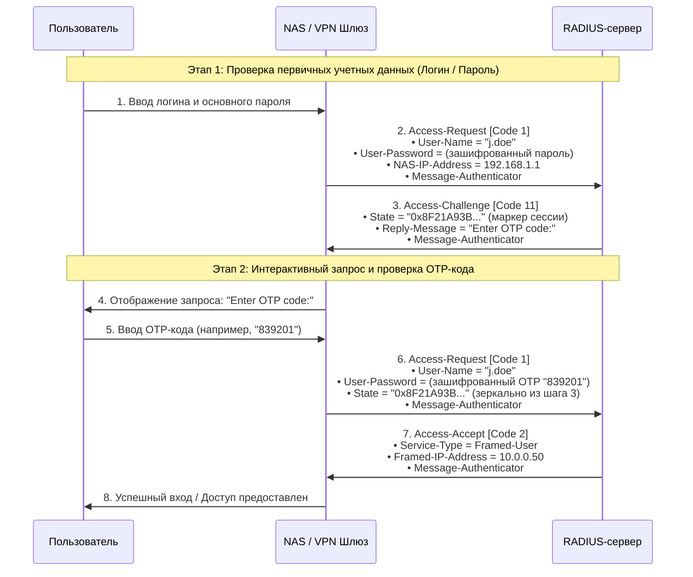
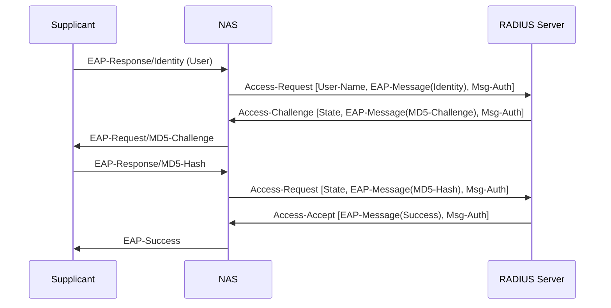
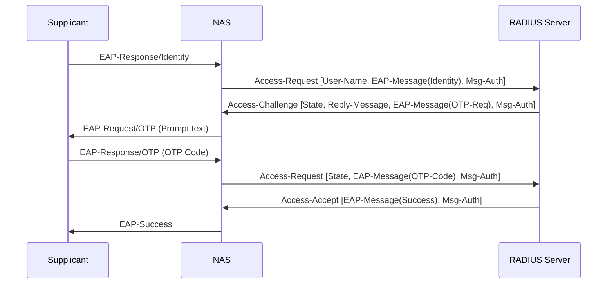
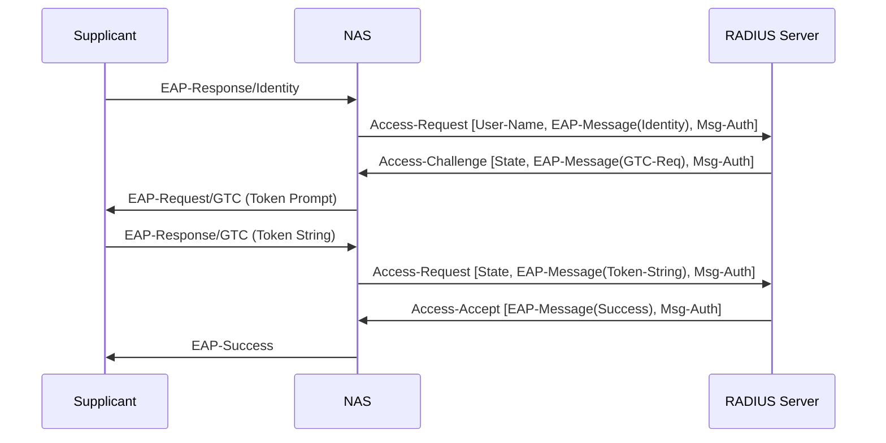
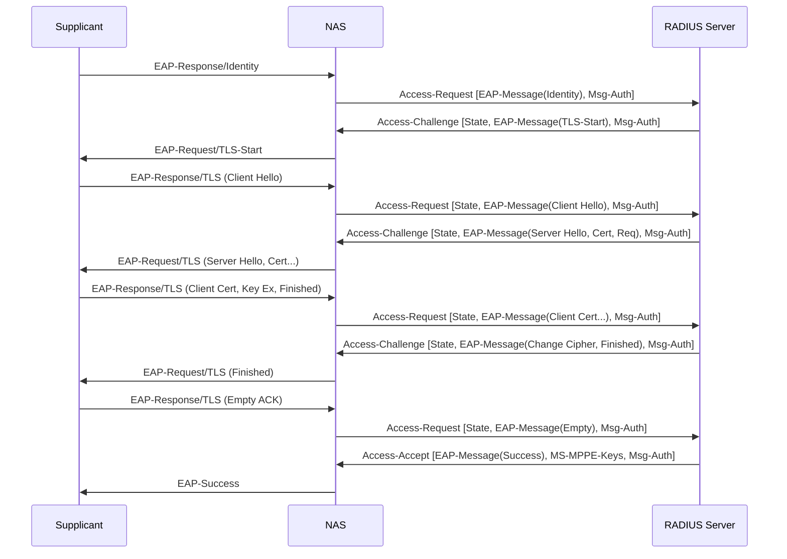
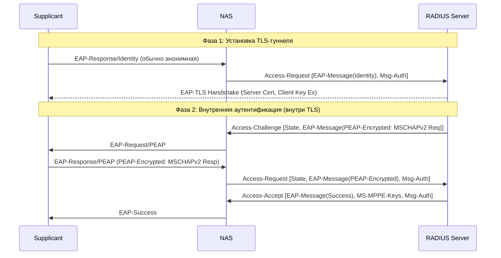
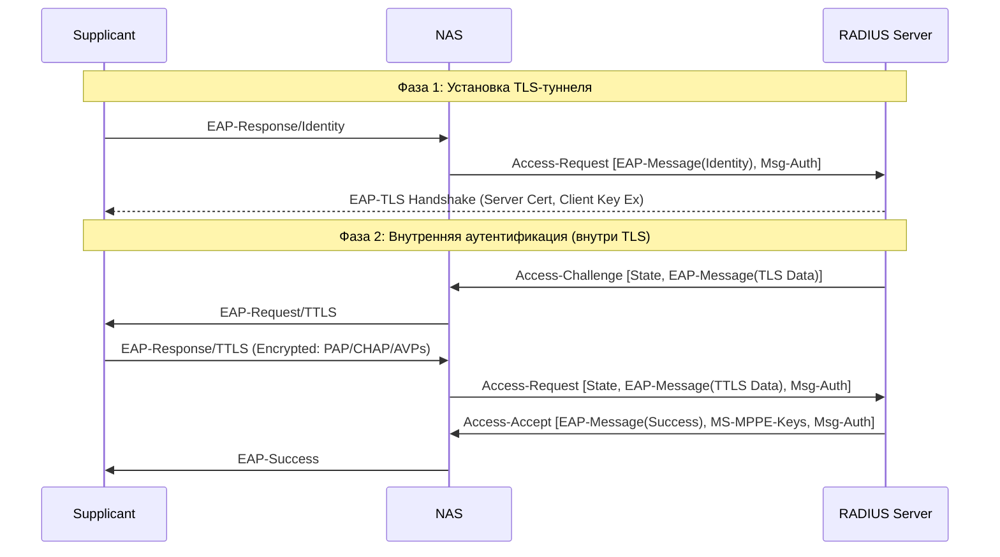
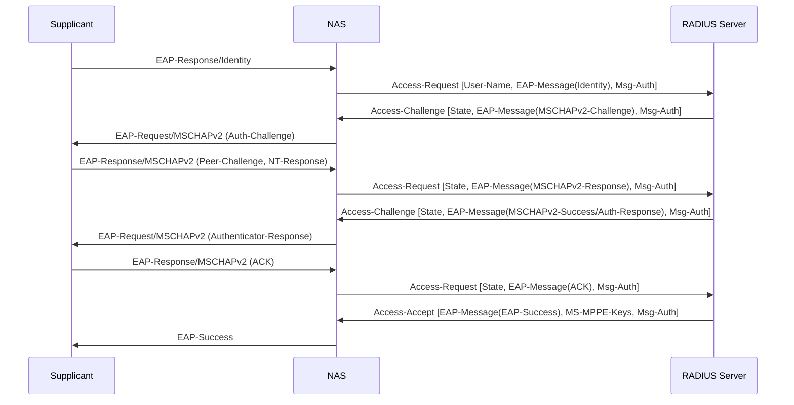
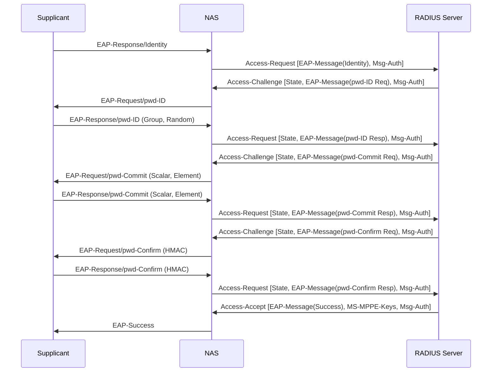
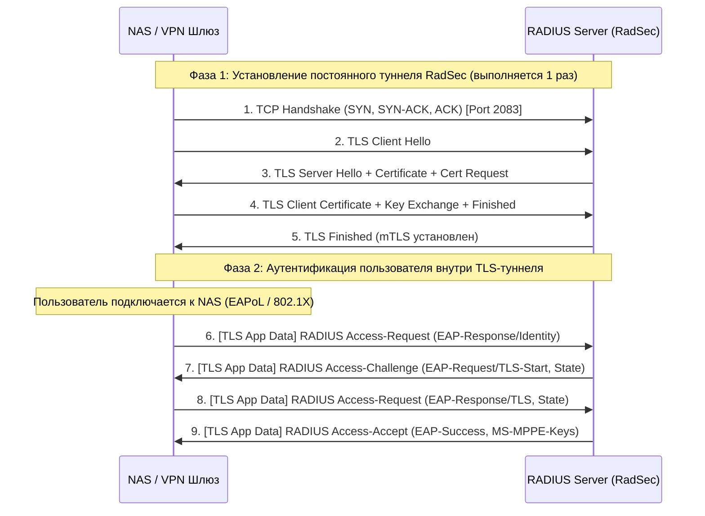

### Protocol RFC 2865
Каждое сообщение RADIUS — это самодостаточная датаграмма (Binary Datagram), содержащая 20-байтовый заголовок фиксированного размера и набор атрибутов переменной длины. 

```
+-------------------------------------------------------------------+
| IP Header (UDP)                                                   |
+-------------------------------------------------------------------+
| UDP Header (Port 1812)                                            |
+-------------------------------------------------------------------+
| RADIUS Header (Code, Identifier, Length, Authenticator)           |
+-------------------------------------------------------------------+
| RADIUS Attributes (type - len - value)                            |
|  ├── Attr  1: User-Name ("j.doe")                                 |
|  ├── Attr  4: NAS-IP-Address (10.0.0.1)                           |
|  ├── Attr 79: EAP-Message                                         |
|  └── Attr 80: Message-Authenticator (HMAC-MD5)                    |
+-------------------------------------------------------------------+
```

Заголовок состоящий из:
* Code (1 байт / 8 бит): Access-Request, Access-Accept, Access-Reject и тп
* Identifier (1 байт / 8 бит): Сквозной ID запроса (от 0 до 255). Так как UDP не гарантирует порядок и сопоставление, клиент (NAS) ставит этот ID, а сервер ОБЯЗАН вернуть тот же самый ID в ответе (Accept, Reject или Challenge). По нему NAS понимает, на какой именно запрос пришел ответ.
* Length (2 байта / 16 бит): Полная длина RADIUS-пакета в байтах (включая заголовок Code+Identifier+Length+Authenticator и все атрибуты).
* Authenticator (16 байт / 128 бит): если это запрос от NAS то указывается Request Authenticator: Случайное 16-байтовое число (Salt), генерируемое клиентом (NAS). Используется как соль для шифрования паролей (например, User-Password маскируется через MD5 с использованием Shared Secret и этого Authenticator).
Если это ответ то Response Authenticator, где передается хеш MD5 от комбинации [Code + Identifier + Length + Request Authenticator + Attributes + Shared Secret]. Гарантирует NAS, что ответ пришел именно от того сервера, у которого есть такой же Shared Secret, и что пакет не подменили по дороге.

После 20-байтового заголовка идут атрибуты — пары «ключ-значение», упакованные в стандартную TLV-структуру:
Type (1 байт): Номер атрибута (например: 1 = User-Name, 2 = User-Password, 4 = NAS-IP-Address).
Length (1 байт): Общая длина этого атрибута (Type + Length + Value).
Value (от 0 до 253 байт): Полезная нагрузка указанная из типа (строка, IP-адрес, число, бинарные данные).

Пример с вводом ОТР кода


### RFC 2869 / RFC 3579 EAP authentification
RFC 3579 принес возможность встраивать в протокол RADIUS протокол аутентификации EAP (EAP внутри RADIUS EAP-Message) и добавил аттрибут 80 подпись пакетов через Message-Authenticator
EAP-пакет встраивается в секцию атрибутов (Attributes Payload) RADIUS-запросов (Access-Request, Access-Challenge, Access-Accept, Access-Reject).

| EAP Type	|Type ID|How auth works |	Notes |
| --------- | ------|---------------|--------|
|EAP-MD5	|4	    | MD5(ID ‖ pwd ‖ challenge)	| Easiest no PKI needed |
|EAP-OTP	|5	    | Server sends a text prompt, client sends one-time password |	Trivial to add — same 2-round flow |
|EAP-GTC	|6	    | Generic token card; server sends challenge string, client sends token value |	Cisco proprietary but trivial to parse |
|EAP-TLS	|13 	|Mutual certificate auth inside TLS handshake | Multi-fragment; needs crypto/tls + PKI |
|EAP-TTLS	|21	    |TLS tunnel, then inner auth (PAP/CHAP/EAP-MD5 inside) |	Common in enterprise Wi-Fi |
|EAP-PEAP	|25	    |TLS tunnel, then inner EAP-MSCHAPv2 |	Most common in Windows environments |
|EAP-MSCHAPv2|26	|MS-CHAPv2 challenge-response (NT hash based) |	Needs rfc2759 — already in layeh |
|EAP-PWD	|52	    |Dragonfly/SPEKE PAKE — no certificates needed |	Resistant to offline dictionary attacks |

##### EAP-MD5 (MD5-Challenge)
Самый базовый метод. Пароль не передается в открытом виде, передается только MD5-хеш от пароля и случайной строки (Challenge). Сервер не аутентифицируется клиентом (нет взаимной аутентификации).
Ключевые RADIUS атрибуты:
* EAP-Message: Содержит EAP-Identity (логин), затем EAP-MD5 Challenge (случайная строка от сервера), затем EAP-MD5 Response (MD5-хеш от Challenge + Пароль)



##### EAP-OTP (One-Time Password)
Аналогичен MD5, но вместо хеширования клиент отправляет одноразовый пароль. Часто используется с аппаратными токенами или системами, где сервер присылает номер нужного токена в Challenge.

Ключевые RADIUS атрибуты:
* Reply-Message / EAP-Message: Сервер передает строку-запрос (например, "Enter OTP sequence 4").
* EAP-Message: Клиент возвращает введенный код открытым текстом в ответе (безопасность обеспечивается одноразовостью кода).



##### EAP-GTC (Generic Token Card)
Альтернатива EAP-OTP (разработан Cisco). Используется для передачи токенов с аппаратных смарт-карт или программных генераторов. Практически идентично OTP. Токен передается в EAP-Message в текстовом виде. В современных сетях GTC чаще всего используется не как самостоятельный протокол, а как "внутренний" (Inner) метод внутри защищенного EAP-PEAP туннеля для обхода ограничений MSCHAPv2.



##### EAP-TLS
Самый защищенный метод. Требует сертификаты и на сервере, и на клиенте (взаимная аутентификация). Происходит полная установка TLS-сессии.
Ключевые RADIUS атрибуты:
* Из-за ограничений размера пакета RADIUS (4096 байт) сертификаты фрагментируются, и атрибутов EAP-Message может быть несколько в одном Access-Challenge.
* В Access-Accept сервер возвращает атрибуты MS-MPPE-Send-Key и MS-MPPE-Recv-Key (сгенерированные из Master Secret TLS), которые NAS использует для шифрования WPA2/WPA3 или VPN-трафика пользователя.



##### EAP-PEAP (Protected EAP)
Состоит из двух фаз. Фаза 1: Установка TLS-туннеля (сертификат нужен только серверу). Фаза 2: Аутентификация пользователя внутри зашифрованного туннеля (обычно MSCHAPv2).
Ключевые RADIUS атрибуты:
*  На Фазе 1 User-Name часто равен anonymous, чтобы скрыть реальный логин.
*  На Фазе 2 в EAP-Message передается зашифрованный (Encrypted TLS App Data) payload. RADIUS-сервер расшифровывает его внутри себя и обрабатывает вложенный MSCHAPv2.



##### EAP-TTLS (Tunneled TLS)
Похож на PEAP (также две фазы), но в Фазе 2 внутри туннеля передаются не EAP-пакеты, а традиционные протоколы (PAP, CHAP, MSCHAP).
В EAP-PEAP Фаза 2 — это "EAP внутри EAP". В EAP-TTLS Фаза 2 — это RADIUS AVP (Attribute-Value Pairs) внутри TLS. Клиент шифрует и передает обычные атрибуты (например, User-Name и User-Password для PAP), которые распаковываются сервером.



##### EAP-MSCHAPv2
В отличие от EAP-MD5, обеспечивает взаимную аутентификацию (клиент тоже проверяет, что сервер знает пароль) и позволяет менять пароль. Обычно работает не напрямую, а внутри PEAP.
Трехстороннее рукопожатие:
Сервер шлет Auth-Challenge.
Клиент отвечает Peer-Challenge и хешем NT-Response.
Сервер присылает Authenticator-Response (доказывая клиенту, что пароль верен).
Все это инкапсулируется в атрибут EAP-Message (OpCodes: Challenge, Response, Success, Failure).



##### EAP-PWD
Современный протокол на базе эллиптических кривых и Dragonfly Key Exchange (тот же механизм, что в WPA3/SAE). Устойчив к оффлайн-брутфорсу словарям (в отличие от MSCHAPv2).
Содержит три обязательных раунда (ID, Commit, Confirm) обмена математическими параметрами кривых.
EAP-Message переносит элементы эллиптической кривой. Как и в TLS, в финальном Access-Accept сервер выдает MS-MPPE-Keys (сессионные ключи), сгенерированные без прямой передачи хеша пароля по сети.



### RadSEC RFC 6614 / RFC 7360
Эволюция безопасности и уход от простого UDP. RADIUS over TLS / DTLS (RFC 6614). Суть: Завернуть весь RADIUS-трафик в безопасный туннель (TLS по TCP или DTLS по UDP). При этом сохраняется поддержка EAP
    TLS https://www.rfc-editor.org/info/rfc6614/
    DTLS https://www.rfc-editor.org/info/rfc7360/



Внутри состав пакета практически такой же
```
+-----------------------------------------------------------------------+
| Ethernet Header                                                       |
+-----------------------------------------------------------------------+
| IP Header (Source: NAS-IP, Destination: RADIUS-IP)                    |
+-----------------------------------------------------------------------+
| TCP Header (Source Port: 49152, Destination Port: 2083)               |
+-----------------------------------------------------------------------+
| TLS Record Header (Type: Application Data [23], Version: TLS 1.3)     |
+-----------------------------------------------------------------------+
|  [ ЗАШИФРОВАННАЯ ПОЛЕЗНАЯ НАГРУЗКА TLS ]                              |
|  ┌─────────────────────────────────────────────────────────────────┐  |
|  │ RADIUS Packet Header:                                           │  |
|  │  ├── Code: Access-Request (1)                                   │  |
|  │  ├── Identifier: 0x42                                           │  |
|  │  ├── Length: 128 байт                                           │  |
|  │  └── Authenticator: 16 байт (в RFC 6614 заполняется нулями)     │  |
|  │ RADIUS Attributes:                                              │  |
|  │  ├── Attr 1  (User-Name): "j.doe@domain.com"                    │  |
|  │  ├── Attr 79 (EAP-Message): [EAP Payload]                       │  |
|  │  ├── Attr 24 (State): "0x981A..."                               │  |
|  │  └── Attr 80 (Message-Authenticator): HMAC-MD5                  │  |
|  └─────────────────────────────────────────────────────────────────┘  |
+-----------------------------------------------------------------------+
```
* Request Authenticator = 16 нулей (0x00...00): Поскольку за целостность и аутентификацию источника теперь отвечает слой TLS, поле Request Authenticator в Access-Request больше не нужно защищать с помощью Shared Secret. RFC 6614 предписывает заполнять его нулями.
* Message-Authenticator (Attr 80) и Shared Secret: Для локальных подключений Shared Secret становится формальностью (часто задается значением radsec). Однако если запрос передается дальше через цепочку RadSec-прокси, Message-Authenticator сохраняется для сквозной проверки.

### Динамическая авторизация — CoA и Disconnect (RFC 3576 / RFC 5176)
Суть: Раньше RADIUS-сервер был пассивным: он только отвечал на запросы NAS. RFC ввел CoA (Change of Authorization) и Disconnect Messages. Теперь RADIUS-сервер сам может отправить на NAS пакет: "Сбрось этого пользователя прямо сейчас" (Disconnect-Request) или "Поменяй ему VLAN/скорость на лету" (CoA-Request)

### Diameter
Наследник нового поколения (RFC 3588 / RFC 6733). Суть: Полный отказ от RADIUS в пользу переработанного с нуля протокола (Diameter = «в два раза больше, чем Radius»).

### Модель угроз
Для базового radius
- подделка Access-Request. 
    Уязвимо: если используется нативные сценарии PAP, CHAP, MS-CHAP. 
    Безопасно: пакеты Access-Request, не содержащие атрибут Message-Authenticator, могут быть легко подделаны. Чтобы избежать этой проблемы, серверные реализации могут быть настроены таким образом, чтобы требовать наличия атрибута Message-Authenticator во всех пакетах Access-Request. Запросы, не содержащие атрибут Message-Authenticator, ДОЛЖНЫ быть молча отброшены. Даже в сценариях с EAP (EAP-MD5, EAP-TLS, PEAP, EAP-TTLS, EAP-MSCHAPv2 и т.д.), а также в запросах CoA (Change of Authorization) или Disconnect-Request
- BlastRADIUS. перехват сообщение от сервера к клиенту и их модифификация был отказ стало разрешено, Протокол RADIUS работает поверх UDP. Без дополнительной защиты атрибуты внутри пакета передаются в открытом виде.
    Уязвимо: если используется нативные сценарии PAP, CHAP, MS-CHAP. см https://www.ietf.org/archive/id/draft-dekok-radext-review-radius-00.html#section-5.2; https://datatracker.ietf.org/doc/html/draft-ietf-radext-deprecating-radius-07; https://www.ietf.org/archive/id/draft-dekok-radext-review-radius-00.html#section-3.1
    Безопасно: 
    - RadSec RADIUS over TLS / DTLS / IPsec (часто невозможно реализовать т.к. зависит от канала и инфораструктуры). Или
    - Серверы обязаны включать Message-Authenticor в качестве первого атрибута во все ответы на пакеты Access-Request, а также отбрасывать пакеты, в которых он отсутствует.
    - Флаг "limit Proxy-State" позволяет серверам обнаруживать и предотвращать атаки, когда пакеты Access-Request не содержат Message-Authenticator. Эта конфигурация необходима только в том случае, если сервер является прокси-сервером. Включение флага "limit Proxy-State" позволяет использовать устаревшие клиенты без существенного ущерба для безопасности
    - Логировать отсутствие Message-Authenticator, использование UDP без защищенного транспорта, слабые Shared Secret и устаревшие методы аутентификации
- Подмена атрибутов авторизации (Attribute Tampering)
В базовом RADIUS Access-Request пакет передается практически в открытом виде (зашифрован только пароль).
Угроза: Злоумышленник на сетевом пути может изменять атрибуты "на лету" — например, перехватить Access-Request и изменить NAS-Port-Type, Calling-Station-Id (MAC-адрес), или понизить параметры шифрования.
Защита: Message-Authenticator подписывает атрибуты целиком. Изменение хотя бы одного бита делает пакет недействительным.
- Sniffing / Metainfo leakedge. Утечка атрибутов сеанса такие как MAC адреса, IP, имена устройств, NAS-Identifier, Location, кол-во трафика и т.п.
- Использование атрибута Tunnel-Password в пакетах CoA-Request и Disconnect-Request. Tunnel-Password шифруется с помощью Salt см. раздел 3.5 (RFC2868) с длиной 15 символов
- Атаки на MS-CHAP https://www.ietf.org/archive/id/draft-dekok-radext-review-radius-00.html#section-5.2
- Длина общего секрета. Любой Shared Secret длиной ≤8 символов следует считать уже скомпрометированным. Минимально 32-64 random bytes

Для EAP через UDP
- Даунгрейд и Spoofing в EAP-протоколах. В интерактивных EAP-сессиях (EAP-TLS, EAP-PEAP) через RADIUS передаются фрагменты EAP-сообщений. Без Message-Authenticator атакующий может внедрять поддельные EAP-Fail ответы или сбрасывать TLS-согласование, проводя DoS или подменяя методы аутентификации на более слабые.
- Инъекция фрагментов и фальсификация сессии при использовании EAP (Session Hijacking / Fragment Injection). Во время многораундовой фрагментации EAP-TLS сервер ожидает куски сертификата от клиента в течение 3–6 запросов. Каждая транзакция привязана к атрибуту State. Если State предсказуем (например, простая последовательная инкрементация 0x0001, 0x0002 на сервере), атакующий на том же сетевом сегменте может отправить поддельный Access-Request с State жертвы и подменить фазу TLS Handshake
- Переполнение буфера и ошибки парсинга (Buffer Overflow / Out-of-Bounds Write). Сервер должен склеивать фрагменты EAP-сообщений в единый буфер в памяти перед тем, как передать его в OpenSSL. В первом фрагменте EAP-TLS передается поле TLS Message Length (заявленный размер, например, 2000 байт). Сервер выделяет буфер в 2000 байт. Затем атакующий начинает слать фрагменты с флагом M (More Fragments), суммарный размер которых превышает 2000 байт. При слабой проверке границ происходит Heap Overflow (переполнение кучи). Overlapping / Bad Offset: Подобно старой атаке Teardrop на IP-уровне, атакующий может манипулировать размерами фрагментов, чтобы вызвать запись по отрицательным смещениям в памяти.
- Истощение ресурсов и DoS (State & Memory Exhaustion) На каждый фрагментированный запрос сервер вынужден держать состояние сессии в памяти. Атакующий начинает EAP-TLS хэндшейк, присылает первый фрагмент с флагом M=1 (More Fragments), получает ACK, но вместо завершения отправляет бесконечный поток новых мелких фрагментов или просто бросает сессию. Генерация тысяч параллельных фрагментированных сессий со случайных MAC/IP. Если у сервера нет строгого лимита на время сборки и число полуоткрытых EAP-сессий, он быстро израсходует оперативную память и таблицы состояний.

Для RadSEC
- TCP SYN-Flood & Connection Exhaustion: Атакующий может завалить порт 2083 запросами на открытие TCP-соединений, исчерпав сокеты сервера или лимит файлов descriptors (ulimit).
-  Slowloris / TLS Handshake Exhaustion: Инициация множества TLS-хэндшейков без их завершения. Вычисление криптографии RSA/ECC на этапе TLS Handshake требует от сервера значительно больше CPU, чем от клиента.
- Проблема исчерпания 8-битного поля Identifier (Concurrent ID Exhaustion) - В заголовок RADIUS заложено поле Identifier размером всего 1 байт (значения от 0 до 255). Это означает, что в один момент времени внутри одного TLS-туннеля не может быть больше 256 активных (неполучивших ответ) запросов. Решается только поддержкой со стороны NAS/Server открытия нескольких параллельных TCP-соединений (Connection Pooling).
- проблема прокси серверов. TLS шифрует трафик только между соседними узлами (Hop-by-Hop). На промежуточном Proxy Server TLS-сессия завершается, пакет расшифровывается в память прокси и зашифровывается заново. Администратор промежуточного прокси-сервера может видеть в открытом виде внутренние атрибуты RADIUS (User-Name, Calling-Station-Id, атрибуты перенаправления), а при использовании слабого внутреннего EAP (например, EAP-TTLS-PAP) — даже чистые пароли пользователей.

# Обязательные требования
после получения Access-Request сервер обязан сформировать State параметр длиной - N (Криптографический / Непредсказуемый State 128-битный токен) и отправить его в сообщении Access-Challenge. после получения второго Access-Request с ОТР кодом проверить state и otp код. если его не будет отклонить запрос и залогировать событие. для доп безопасности можно сделать привязку к User-Name / Calling-Station-Id

Определить время на ввод ОТР кода - по истечению которого закрыть соединение

обязательно требовать Message-Authenticator (Attribute 80) в каждом запросе Access-Request от NAS и обязан проверяться на каждом этапе общения с клиентом

Request Authenticator - 

Ограничение максимального размера EAP-сообщения: Задать жесткий лимит на итоговый склеенный EAP-пакет (например, не более 16–32 КБ). Ни один валидный сертификат WPA-Enterprise не требует сборки EAP-фрейма размером в мегабайты. При объединении нескольких EAP-Message (Attr 79) внутри одного пакета сервер должен проверять суммарную длину с учетом реального поля EAP Length в заголовке, а не слепо доверять длине атрибута RADIUS. Если сумма длин полученных фрагментов превышает заявленный TLS Message Length, сессия должна немедленно расторгаться с ошибкой.

Защита от DoS и управление таймаутами. Установите жесткий таймаут на время жизни неоконченной EAP-сессии (обычно 10–15 секунд). Если за это время клиент не завершил передачу фрагментов EAP-TLS, состояние уничтожается. Лимит на число раундов (Max Fragments Count) Ограничьте максимальное количество шагов обмен-ответ для одной сессии (например, не более 50 раундов Challenge-Response). Rate Limiting неоконченных сессий: Ограничение количества одновременных фрагментированных сессий от одного NAS или MAC-адреса.

# Источники
https://www.ietf.org/archive/id/draft-dekok-radext-review-radius-00.html
