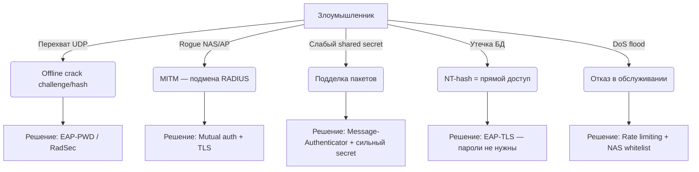

```
# Терминал 1 — сервер
cd d:\Project\GoSecurity\RADIUS
go run .\server\rfc3579\server.go

# Терминал 2 — клиент (после того как сервер написал "EAP-MD5 RADIUS server on :1812")
cd d:\Project\GoSecurity\RADIUS
go run .\client\rfc3579\client.go

# Безопасная остановка только слушающего порта
Get-Process | Where-Object { $_.MainWindowTitle -eq "" -and $_.Name -eq "server" } | Stop-Process
# или просто Ctrl+C в терминале с сервером
```


## Уязвимости EAP-MD5 и EAP-MSCHAPv2

### EAP-MD5 — слабости протокола

| Уязвимость | Суть | Риск |
|---|---|---|
| **Offline dictionary attack** | Перехваченная пара `(challenge, hash)` позволяет брутфорсить пароль без контакта с сервером | Критический |
| **Нет mutual auth** | Клиент не проверяет сервер — возможна подмена RADIUS/NAS (rogue AP) | Высокий |
| **MD5 устарел** | Коллизии в MD5 хотя и не применимы напрямую к HMAC-варианту, но алгоритм признан слабым | Средний |
| **Replay без Message-Authenticator** | Без атрибута `Message-Authenticator` (тип 80) пакеты можно переиграть или подделать | Высокий |
| **Нет forward secrecy** | Компрометация пароля раскрывает все прошлые сессии | Высокий |

> EAP-MD5 **запрещён** в Wi-Fi (IEEE 802.11) именно из-за отсутствия mutual auth и тривиального перехвата.

---

### EAP-MSCHAPv2 — слабости протокола

| Уязвимость | Суть | Риск |
|---|---|---|
| **NT-hash как "пароль"** | MSCHAPv2 аутентифицирует не пароль, а `NTHash(password)`. Утечка хэша из БД = полный доступ | Критический |
| **MSCHAP offline crack** | Атака Chapcrack/asleap: из перехваченного handshake восстанавливается NT-hash за часы (GPU) | Критический |
| **Server auth обходится** | Mutual auth (`AuthenticatorResponse`) клиент может не проверять — MITM через rogue RADIUS | Высокий |
| **MS-CHAPv2 без туннеля = голый** | Используется вне PEAP/TTLS — весь handshake виден в открытом RADIUS-трафике | Критический |
| **DES в ядре** | Внутри использует 3× DES56 — тривиально брутфорсится по частям (40-битные ключи) | Высокий |
| **Нет PFS** | То же что у MD5 | Высокий |

---

### Атаки на сам RADIUS-транспорт (актуально для обоих)

```
NAS ──── UDP/1812 (открытый текст) ──── RADIUS Server
              ↑
         злоумышленник в сети
```

| Атака | Что происходит |
|---|---|
| **Shared secret brute-force** | RADIUS использует MD5(secret + authenticator) для защиты — слабый secret = компрометация всего |
| **Request forgery** | Без `Message-Authenticator` можно подделать Access-Request с нужным `User-Name` |
| **Response spoofing** | Подделать Access-Accept если известен или угадан secret |
| **DoS — flood Access-Request** | Сервер обрабатывает каждый пакет; нет встроенного rate-limit |
| **State токен угадывание** | Если State генерируется предсказуемо — можно угнать чужую сессию (как в вашем PoC: `rand.Read` достаточно, но нужен CSPRNG) |

---

## Что реализовать при проектировании сервера

### 1. Транспорт — RadSec (RADIUS over TLS, RFC 6614)

Самое важное изменение. Заменяет UDP+shared secret на TLS 1.3:

```
NAS ──── TLS 1.3 / TCP 2083 ──── RADIUS Server
```

- Убирает все атаки на транспортный уровень
- Mutual auth через сертификаты (NAS должен иметь клиентский cert)
- Forward secrecy из коробки

### 2. Message-Authenticator — обязателен везде

Атрибут типа 80: `HMAC-MD5(весь пакет, secret)`. Должен присутствовать:
- В **каждом** Access-Request с EAP-Message
- В **каждом** Access-Challenge / Accept / Reject

Без него — возможна подделка пакетов.

### 3. Замена EAP-MD5 на EAP-PWD или EAP-TLS

| Если хотите без PKI | Если можете выдать сертификаты |
|---|---|
| **EAP-PWD (RFC 5931)** — PAKE на основе Dragonfly, устойчив к offline-атакам, mutual auth | **EAP-TLS (RFC 5216)** — золотой стандарт, mutual auth, PFS |

### 4. Если оставляете MSCHAPv2 — только внутри туннеля

```
EAP-PEAP [ TLS tunnel [ EAP-MSCHAPv2 ] ]
         ↑
  шифрует весь handshake
```

Без внешнего TLS-туннеля MSCHAPv2 бессмысленно использовать.

### 5. Хранение паролей на сервере

| Что не делать | Что делать |
|---|---|
| Plaintext пароли | Нужны для EAP-MD5/MSCHAPv2 — это их фундаментальная проблема |
| NT-hash в открытом виде в БД | Шифрование at-rest (AES-256) + HSM если серьёзно |
| — | Для EAP-TLS пароли не нужны вообще — только сертификаты |

> EAP-MD5 и EAP-MSCHAPv2 **требуют знания plaintext пароля** на сервере (или NT-hash для MSCHAPv2). Это архитектурное ограничение, которое не устранить.

### 6. Rate limiting и защита от DoS

- Ограничение Access-Request по IP NAS: не более N запросов/сек
- Account lockout: после K неудачных попыток — временная блокировка аккаунта
- Whitelist NAS по IP + shared secret (не принимать пакеты от неизвестных источников)

### 7. Генерация случайных значений

В вашем PoC `rand.Read(challenge)` — это `crypto/rand`, что правильно. **Никогда** не использовать `math/rand` для challenge/state.

### 8. Логирование и аудит

- Логировать: IP NAS, Username, результат, timestamp — **без** пароля и хэша
- Алерт на: серия отказов с одного NAS, необычный username enumeration

---

## Итоговая картина угроз



**Главный вывод**: если проектируете с нуля — используйте **EAP-TLS + RadSec**. EAP-MD5 и EAP-MSCHAPv2 несут фундаментальные криптографические слабости, которые не решаются на уровне реализации сервера.

### Требования 
| Категория             | Рекомендуемые меры                                                                                                     |
| --------------------- | ---------------------------------------------------------------------------------------------------------------------- |
| Аутентификация NAS    | Белый список NAS, уникальный Shared Secret на каждый NAS, проверка IP и `Message-Authenticator`                        |
| EAP-сессии            | Случайные Challenge, одноразовый `State`, ограниченный TTL, защита от повторов                                         |
| Криптография          | CSPRNG для Challenge и nonces, постоянное время сравнения секретов                                                     |
| Защита от DoS         | Rate limiting, лимиты на число активных сессий, очистка истекших состояний, ограничение размеров EAP-сообщений         |
| Проверка пакетов      | Строгая валидация всех атрибутов RADIUS и EAP, проверка длин, типов и обязательных полей                               |
| Авторизация           | Никогда не доверять атрибутам из запроса клиента, все политики формировать на сервере                                  |
| Журналирование        | Исключить секреты из логов, логировать идентификаторы сессий и причины отказов                                         |
| Современные протоколы | Предпочитать EAP-TLS или PEAP/EAP-TLS вместо EAP-MD5; EAP-MSCHAPv2 использовать только при необходимости совместимости |
